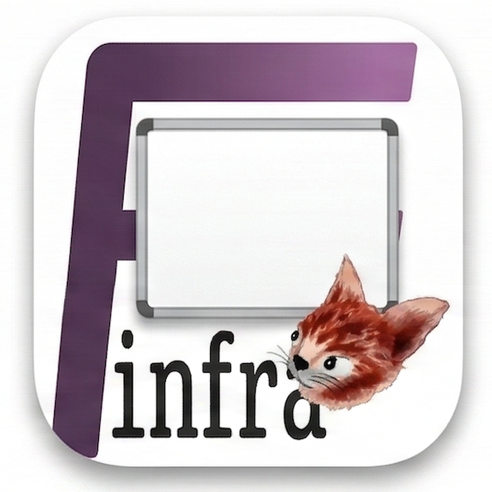

<a href="https://finfra.kr/product/fBoard/en/index.html"> Product Page</a>

> **Catch everyone's eye with your own custom screen board.**

macOS Custom Background Tool. Create beautiful presentation backgrounds, protect desktop privacy, and match your brand colors with one click.

# Features

* **Beautiful Backgrounds** - Custom backgrounds for presentations
* **Privacy Protection** - Hide desktop information instantly
* **Easy Customization** - Solid color, gradient, and image backgrounds
* **One-click Cleanup** - Simple menu bar icon activation
* **Color Matching** - Match your brand colors
* **Multi-Display Support** - Works across multiple monitors
* **AI Agent Integration** - Automate with Claude, Gemini, and MCP

# AI Agent Integration

Automate and extend fBoard with AI agents. All integration methods use the built-in REST API.

| Platform   | Integration Method          | Details                                      |
| ---------- | --------------------------- | -------------------------------------------- |
| **Claude** | Marketplace Plugin (Skill)  | [Install via Claude Code](./agents/claude/)  |
| **Gemini** | Workflow Installation       | [Install via Gemini](./agents/gemini/)       |
| **MCP**    | Model Context Protocol Server | [MCP Server Setup](./mcp/)                 |

# Requirements

* macOS 12.0 or later

# Product Page

| Language | Link                                                                    |
| -------- | ----------------------------------------------------------------------- |
| English  | [fBoard - Product Page](https://finfra.kr/product/fBoard/en/index.html) |
| Korean   | [fBoard - 제품 페이지](https://finfra.kr/product/fBoard/kr/index.html)  |

# Other Apps by finfra

| App          | Description                                      | Link                                                                     |
| ------------ | ------------------------------------------------ | ------------------------------------------------------------------------ |
| fSnippet     | Powerful text expansion & snippet tool           | [Product Page](https://finfra.kr/product/fSnippet/en/index.html)        |
| fWarrange    | The ultimate Mac window manager & layout restore | [Product Page](https://finfra.kr/product/fWarrange/en/index.html)       |
| fBanner      | Clipboard to banner image, instantly             | [Product Page](https://finfra.kr/product/fBanner/en/index.html)         |
| fQRGen       | Clipboard to QR code, instantly                  | [Product Page](https://finfra.kr/product/fQRGen/en/index.html)          |
| fGoogleSheet | The fastest Google Sheets menu bar app for Mac   | [Product Page](https://finfra.kr/product/fGoogleSheet/en/index.html)    |

# Documentation

| Document                              | Description                      |
| ------------------------------------- | -------------------------------- |
| [Manual](./manual/)                   | User manual (KR/EN)              |
| [REST API](./api/)                    | REST API reference & OpenAPI spec |
| [MCP Server](./mcp/)                  | Model Context Protocol server    |
| [Claude Code Skill](./agents/claude/) | Claude Code plugin               |
| [Localization](./localization/)       | Multi-language string resources  |

# Community & Support

## Issues
* [GitHub Issues](https://github.com/Finfra/fBoard_public/issues)

## Board (English)
| Category | Link                                                             |
| -------- | ---------------------------------------------------------------- |
| Notice   | [fBoard Notice](https://finfra.kr/w1/category/fboard-notice/)   |
| Guide    | [fBoard Guide](https://finfra.kr/w1/category/fboard-guide/)     |
| QnA      | [fBoard QnA](https://finfra.kr/w1/category/fboard-qna/)         |
| Feedback | [fBoard Feedback](https://finfra.kr/w1/category/fboard-feedback/) |

## Board (Korean)
| Category | Link                                                                  |
| -------- | --------------------------------------------------------------------- |
| Notice   | [fBoard 공지](https://finfra.kr/w1/category/fboard-notice-kr/)       |
| Guide    | [fBoard 사용법](https://finfra.kr/w1/category/fboard-guide-kr/)      |
| QnA      | [fBoard QnA](https://finfra.kr/w1/category/fboard-qna-kr/)           |
| Feedback | [fBoard 피드백](https://finfra.kr/w1/category/fboard-feedback-kr/)   |

# License

Copyright (c) finfra.kr. All rights reserved.
